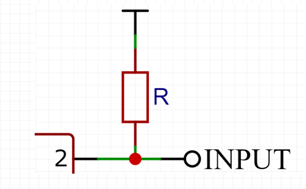
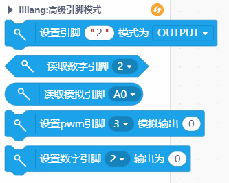
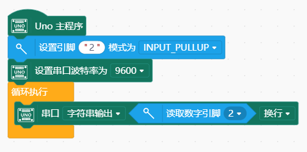

# pinMode 引脚模式设置




---------------------------------------------------------

## Table of Contents

* [URL](#url)
* [Summary](#summary)
* [Blocks](#blocks)
* [License](#license)
* [Supported targets](#Supportedtargets)

## URL
* Project URL : ```https://github.com/liliang9693/ext-pinMode```

* Tutorial URL : ```https://mindplus.dfrobot.com.cn/extensions-user```


## Summary
此扩展可以独立设置引脚模式，同时引脚输入框可以插入变量方便灵活使用。注意与Mind+中主控板自带的引脚控制积木不可混用。

## Blocks




## Examples



## License

MIT

## Supported targets

MCU                | JavaScript    | Arduino   | MicroPython    | Remarks
------------------ | :----------: | :----------: | :---------: | -----
arduino        |             |        √      |             | 
micro:bit        |             |       √       |             | 
esp32        |             |        √      |             | 


## Release Logs
* V0.0.1  基础功能完成

